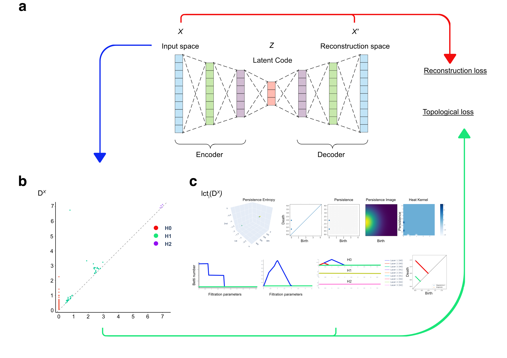
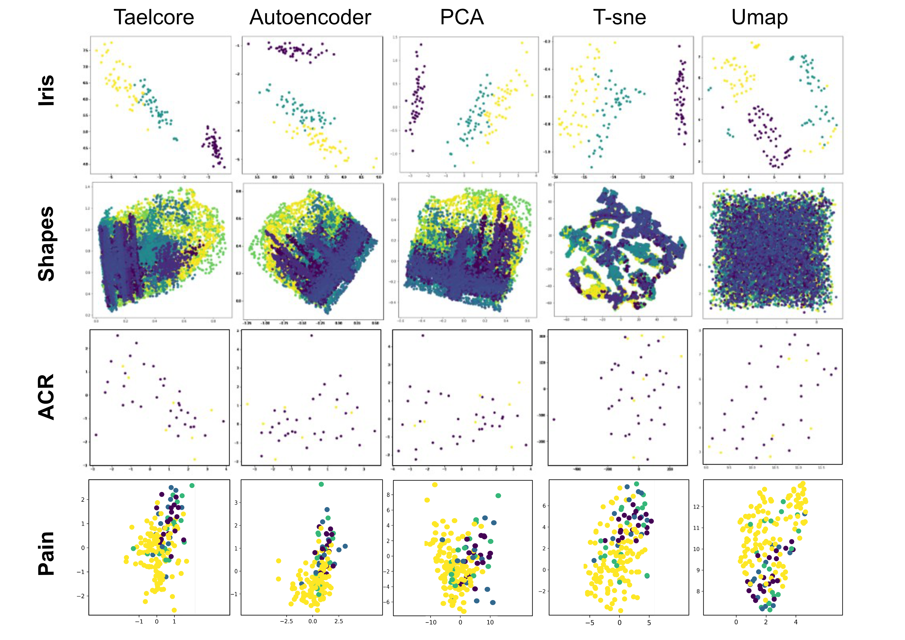

<div align="center">

# 🌀 TaelCore

### Topological Autoencoder with Best Linear Combination for Optimal Reduction of Embeddings

[](https://choosealicense.com/licenses/gpl-3.0/)
[](https://pypi.org/project/taelcore/)
[](https://www.piwheels.org/project/taelcore/)
[](https://www.python.org/)
[](https://doi.org/10.1016/j.compbiomed.2024.107969)
[](https://colab.research.google.com/github/MorillaLab/Taelcore/blob/main/Pain_Dimension_Reduction.ipynb)

**TaelCore** is a novel dimensionality reduction method that combines topological data analysis (TDA) with autoencoders to produce richer, more linearly separable latent representations — outperforming PCA, t-SNE, UMAP, and standard autoencoders on clinical and benchmark datasets.

📦 Install in seconds · 📄 Peer-reviewed in *Computers in Biology and Medicine* · 🫁 Validated on lung transplantation data

[📄 Paper](#-citation) · [🚀 Quick Start](#-quick-start) · [📊 Results](#-results) · [🏗️ How It Works](#️-how-it-works) · [📦 PyPI Package](#-python-package)

</div>

---

## 🔍 Overview

High-dimensional clinical datasets pose a major challenge for machine learning: standard dimensionality reduction methods either lose local structure (PCA), distort global topology (t-SNE), or produce overly sparse representations (UMAP).

**TaelCore** addresses this by:
1. Training an autoencoder on the input data
2. Enriching the latent space with **topological features** derived from persistent homology (TDA)
3. Finding the **optimal linear combination** of the autoencoder embedding and topological features that maximises downstream predictive performance

The result is a compact, geometrically meaningful embedding that significantly reduces error rates across machine learning algorithms.

> **Application:** We validate TaelCore on acute cellular rejection (ACR) prediction after lung transplantation — a high-stakes clinical classification problem — and on standard benchmark datasets (Shapes, Iris).

---

## 📊 Results

### Latent Space Comparison

TaelCore produces **distinctly separated, linearly decodable clusters** compared to all baselines:

<p align="center">
  
  <br/>
  <em>Latent space representations on Shapes, Iris, and Lung Transplantation datasets.<br/>
  TaelCore (left) vs Autoencoder, PCA, t-SNE, UMAP.</em>
</p>

<p align="center">
  
  <br/>
  <em>Representation learning quality and downstream classification performance.</em>
</p>

### Performance Summary

| Method | Shapes Separation | Iris Linear Sep. | Lung ACR Error Rate |
|---|---|---|---|
| **TaelCore (ours)** | **Best** | **Best** | **Lowest** |
| Autoencoder | Good | Moderate | Moderate |
| PCA | Moderate | Good | High |
| t-SNE | Good | Good | High |
| UMAP | Good | Moderate | Moderate–High |

TaelCore's topological improvements positively affect the **majority of downstream ML algorithms** tested (Autoencoder, MLP, SVM, Random Forest, kNN).

---

## 🏗️ How It Works

TaelCore combines three components:

```
Input Data (high-dim)
       │
       ▼
┌─────────────┐       ┌──────────────────────┐
│ Autoencoder │──────▶│  Latent Embedding (Z) │
└─────────────┘       └──────────────────────┘
                                │
                                ▼
                  ┌─────────────────────────┐
                  │ Topological Feature      │
                  │ Extraction (TDA / PH)    │
                  │  Betti numbers,          │
                  │  persistence diagrams    │
                  └─────────────────────────┘
                                │
                                ▼
                  ┌─────────────────────────┐
                  │ Best Linear Combination  │
                  │ of Z + Topological Feats │
                  └─────────────────────────┘
                                │
                                ▼
                     Enriched Embedding 🎯
```

The key insight: persistent homology captures **multi-scale topological structure** (connected components, loops, voids) that autoencoders miss, and the linear combination step ensures the enrichment is numerically stable and interpretable.

---

## 🚀 Quick Start

### Installation

```bash
pip install taelcore==1.3.1
```

Or install from source:

```bash
git clone https://github.com/MorillaLab/Taelcore.git
cd Taelcore
pip install -r requirements.txt
```

### Basic usage

```python
from taelcore import Taelcore
import numpy as np

# Your high-dimensional dataset
X = np.load("your_data.npy")   # shape: (n_samples, n_features)

# Fit and transform
model = Taelcore(latent_dim=16, topo_weight=0.3)
model.fit(X)
X_reduced = model.transform(X)   # shape: (n_samples, latent_dim)

print(f"Reduced from {X.shape[1]} → {X_reduced.shape[1]} dimensions")
```

### With a downstream classifier

```python
from taelcore import Taelcore
from sklearn.neural_network import MLPClassifier
from sklearn.model_selection import train_test_split
from sklearn.metrics import classification_report

X_train, X_test, y_train, y_test = train_test_split(X, y, test_size=0.2)

# Dimensionality reduction
tael = Taelcore(latent_dim=16)
tael.fit(X_train)
X_train_r = tael.transform(X_train)
X_test_r  = tael.transform(X_test)

# Classification
clf = MLPClassifier(hidden_layer_sizes=(64, 32), max_iter=200)
clf.fit(X_train_r, y_train)
print(classification_report(y_test, clf.predict(X_test_r)))
```

### Reproduce the paper results

```bash
# Data preparation
jupyter nbconvert --to notebook --execute Data_preparation.ipynb

# Pain / dimensionality reduction analysis
jupyter nbconvert --to notebook --execute Pain_Dimension_Reduction.ipynb
```

See the [`Dimensionality reduction/`](Dimensionality%20reduction/) and [`Topological improvement/`](Topological%20improvement/) folders for all paper experiments.

---

## 📦 Python Package

TaelCore is available on PyPI:

```bash
pip install taelcore
```

| | |
|---|---|
| **Latest version** | 1.3.1 |
| **PyPI page** | https://pypi.org/project/taelcore/ |
| **Piwheels (ARM)** | https://www.piwheels.org/project/taelcore/ |
| **Python support** | 3.8, 3.9, 3.10, 3.11 |

---

## 📁 Repository Structure

```
Taelcore/
├── Taelcore/                       # Core library source code
├── Pip/taelcore/                   # PyPI packaging files
├── Dimensionality reduction/       # Comparison experiments (PCA, t-SNE, UMAP, AE)
├── Dimension reduction tech/       # Technique deep-dives
├── Topological improvement/        # TDA enrichment experiments
├── Gif/                            # Animations of latent space evolution
├── Data_preparation.ipynb          # Data loading & preprocessing
├── Pain_Dimension_Reduction.ipynb  # Main analysis notebook
├── Figure_1.pdf                    # Architecture overview
├── Figure_2.pdf                    # TDA pipeline
├── Figure_3_3.png                  # Latent space comparison
├── Figure_4_4.png                  # Representation learning results
├── Taelcore_Overview.pdf           # Extended technical overview
├── requirements.txt                # Python dependencies
└── LICENSE                         # GPL-3.0
```

---

## 🗂️ Datasets

TaelCore is validated on three datasets:

| Dataset | Type | Task | N | Dim |
|---|---|---|---|---|
| **Shapes** | Synthetic | Cluster separation | — | — |
| **Iris** | Benchmark | Multi-class classification | 150 | 4 |
| **Lung Transplantation** | Clinical | ACR detection (binary) | — | High-dim |

The lung transplantation dataset is proprietary clinical data from Hôpital Bichat, Paris. Contact the authors for data access enquiries.

---

## 🎈 Citation

If you use TaelCore in your research, please cite:

```bibtex
@article{GOUIAA2024107969,
  title   = {Novel dimensionality reduction method, Taelcore, enhances lung
             transplantation risk prediction},
  journal = {Computers in Biology and Medicine},
  volume  = {169},
  pages   = {107969},
  year    = {2024},
  issn    = {0010-4825},
  doi     = {10.1016/j.compbiomed.2024.107969},
  url     = {https://www.sciencedirect.com/science/article/pii/S0010482524000532},
  author  = {Gouiaa, Fatma and Vomo-Donfack, Kelly L. and Tran-Dinh, Alexy and Morilla, Ian}
}
```

---

## 🤝 Contributing

We welcome contributions — new benchmarks, alternative TDA features, packaging improvements. Please open an issue first. See [`CONTRIBUTING.md`](CONTRIBUTING.md) for guidelines.

---

## 📜 License

This project is licensed under the GNU General Public License v3.0 — see [`LICENSE`](LICENSE) for details.

---

<div align="center">
  Made with ❤️ by <a href="https://github.com/MorillaLab">MorillaLab</a>
  <br/>
  <sub>Published in <em>Computers in Biology and Medicine</em>, 2024</sub>
</div>

